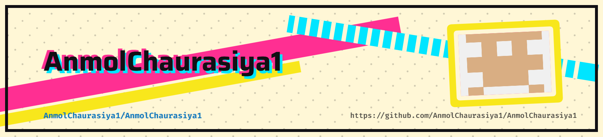

<picture>
   <source media="(prefers-color-scheme: dark)" srcset="art/header-dark.png">
   
</picture>


<!-- ===================================================== -->
<!--                     HEADER                            -->
<!-- ===================================================== -->

<p align="center">


</p>

<h1 align="center">
Hey there 👋 I'm Anmol Chaurasiya
</h1>

<h3 align="center">
Lead Software Engineer • Java Backend Developer • MERN Developer • Cloud & AI Enthusiast
</h3>

<p align="center">


</p>

---

<!-- ===================================================== -->
<!--                     BADGES                            -->
<!-- ===================================================== -->

<p align="center">


</p>

---

# 💫 About Me

<table>

<tr>

<td width="63%">

## 👨‍💻 Software Engineer

I'm **Anmol Chaurasiya**, a passionate **Lead Software Engineer** who enjoys transforming ideas into scalable software products.

My primary expertise lies in building **production-grade backend systems** using **Java**, architecting scalable web applications, integrating enterprise APIs, and deploying reliable cloud-based solutions.

I enjoy solving challenging engineering problems and building applications that are secure, efficient, and user-centric.

---

### 🚀 Current Focus

- 🛒 Multi Vendor Commerce Platforms
- ☁️ Cloud Infrastructure
- 🤖 Artificial Intelligence
- ⚡ Backend Engineering
- 🔥 System Design
- 🌍 Open Source

---

### 🌱 Currently Learning

- Microservices
- Kubernetes
- AI Agents
- LLM Applications
- Distributed Systems
- DevOps
- Spring Boot

---

### 💬 Ask Me About

- Java
- JSP & Servlets
- MERN Stack
- MySQL
- REST APIs
- Cloudflare
- Apache Tomcat
- Nginx
- AWS

</td>

<td width="37%" align="center">


<br><br>


</td>

</tr>

</table>

---

## 🚀 Featured Project

### 🛒 ToyWallah – Multi-Vendor E-Commerce Marketplace

**Role:** Technical Lead

**Highlights**
- Cashfree Merchant Onboarding
- iCarry Logistics Integration
- Cloudflare CDN
- Java • JSP • Servlets
- MySQL
- Apache Tomcat
- Nginx

# 🚀 Quick Facts

<table>

<tr>

<td>

🎓 **Education**

Bachelor of Technology  
Computer Science & Engineering

</td>

<td>

💼 **Current Role**

Lead Software Engineer

</td>

</tr>

<tr>

<td>

🌍 **Location**

Prayagraj, India 🇮🇳

</td>

<td>

📧 **Email**

anmolgaurav2018@gmail.com

</td>

</tr>

<tr>

<td>

☁️ **Interests**

Cloud • AI • DevOps

</td>

<td>

❤️ **Hobbies**

Coding • Building Products • Learning

</td>

</tr>

</table>

---

# ⚡ Tech Stack

<p align="center">


<br>


</p>

---

# 🧠 Core Expertise

<p align="center">

| Backend | Frontend | Database | Cloud | DevOps |
|:-------:|:--------:|:--------:|:------:|:-------:|
| Java | React | MySQL | AWS | Docker |
| Servlets | Next.js | MongoDB | Cloudflare | Linux |
| REST APIs | HTML/CSS | PostgreSQL | GCP | Nginx |
| System Design | JavaScript | Redis | CDN | Git |

</p>

---

# 🎯 What I Love Building

<div align="center">

| 🚀 Enterprise Software | 🛒 E-Commerce | ☁️ Cloud | 🤖 AI |
|-----------------------|--------------|----------|--------|
| Java Applications | Multi Vendor Platforms | DevOps | AI Tools |
| SaaS Products | Payment Integration | CDN | LLM Apps |
| REST APIs | Logistics | Performance | Automation |

</div>

---

<p align="center">


</p>
<!-- ===================================================== -->
<!--                EXPERIENCE TIMELINE                    -->
<!-- ===================================================== -->

# 💼 Professional Experience

<div align="center">

| Company | Role | Duration |
|:--------:|:----:|:-------:|
| 🏢 **International Association of Research and Development Organization (IARDO)** | **Lead Software Engineer** | **Nov 2025 – July 2026** |
| 🌾 **Indian Farmers Fertiliser Cooperative (IFFCO)** | **Software Developer Intern** | **Jun 2025 – Aug 2025** |
| 📱 **Transcend Infosystems Pvt. Ltd.** | **Software Engineering Intern** | **Jun 2024 – Jul 2024** |

</div>

---

## 🏢 Lead Software Engineer • IARDO

📍 India

### Highlights

- 🚀 Led the development of multiple production-grade web applications from concept to deployment.
- 🏗️ Designed scalable backend systems using Java, JSP, Servlets, and MySQL.
- ⚡ Improved application performance, responsiveness, and deployment workflows.
- 🌐 Deployed and maintained production applications using Apache Tomcat, Nginx, Linux, and Cloudflare.
- 🤝 Collaborated with cross-functional teams to deliver enterprise software solutions.
- 🧪 Performed backend testing and validation to ensure application reliability.
- 📚 Documented software architecture and deployment processes for maintainability.

---

## 🌾 Software Developer Intern • IFFCO

📍 Phulpur, Uttar Pradesh

### Highlights

- 💻 Developed internal web applications using PHP, MySQL, JavaScript, HTML, and CSS.
- 🔒 Implemented secure authentication and role-based access.
- 🧪 Performed application testing and database validation.
- 📊 Created datasets for workflow testing and system verification.
- ⚙️ Assisted in improving operational efficiency through software automation.

---

## 📱 Software Engineering Intern • Transcend Infosystems

📍 Noida, Uttar Pradesh

### Highlights

- 📱 Developed Android applications using Java and SQLite.
- 👨‍💼 Built employee registration and monitoring applications.
- 🗄️ Implemented local database management using SQLite.
- 🎨 Designed user-friendly mobile interfaces.

---

# 🚀 Featured Projects

---

## 🛒 ToyWallah

### Multi Vendor E-Commerce Marketplace

🌐 https://toywallah.com

### Tech Stack

`Java` • `JSP` • `Servlets` • `MySQL` • `Cloudflare` • `Nginx` • `Apache Tomcat` • `Cashfree API` • `iCarry API`

### Overview

As the **Technical Lead**, I led the complete architecture, development, deployment, and production support of a large-scale multi-vendor marketplace.

### Key Contributions

- 👨‍💻 Led end-to-end product development.
- 💳 Integrated Cashfree APIs for merchant onboarding, KYC verification, and bank validation.
- 🚚 Integrated iCarry APIs for logistics and shipment tracking.
- 📦 Built Seller, Customer, and Admin portals.
- 📧 Developed automated transactional email workflows using SMTP.
- ☁️ Configured Cloudflare CDN, Nginx, SSL, caching, and production deployment.
- 🗄️ Designed optimized MySQL architecture for scalability.
- ⚡ Improved backend performance using optimized SQL queries.

---

## 💼 Dream Naukri Career

### Recruitment & Hiring Platform

🌐 https://www.dreamnaukricareer.com/

### Tech Stack

`Java` • `JSP` • `Servlets` • `MySQL`

### Features

- Employer Portal
- Candidate Portal
- Resume Management
- Job Posting
- Job Applications
- Authentication
- Admin Dashboard

### Contributions

- Developed the complete recruitment workflow.
- Built employer and candidate dashboards.
- Designed responsive UI and optimized backend.
- Managed deployment and production maintenance.

---

## 📧 Netclix Cloud

### Email Marketing Platform

🌐 https://netclixcloud.com/

### Tech Stack

`Java` • `SMTP` • `MySQL`

### Features

- Email Campaigns
- Contact Lists
- Analytics
- Email Templates
- Scheduling
- Reports

### Contributions

- Developed campaign management modules.
- Implemented email scheduling and automation.
- Built analytics dashboards.
- Optimized backend architecture.

---

## 👕 Bull Clothings

### E-Commerce Platform

🌐 https://bullclothings.com/

### Tech Stack

`Java` • `MySQL` • `Shiprocket`

### Features

- Shopping Cart
- Checkout
- Order Management
- Inventory
- Shipping

### Contributions

- Developed product catalog.
- Integrated payment workflows.
- Implemented shipping integrations.
- Optimized customer experience.

---

## 🌐 MGTM Consultancy

### Corporate Website

### Tech Stack

`MongoDB` • `Express.js` • `React` • `Node.js`

### Contributions

- Developed the complete MERN application.
- Built responsive UI.
- Created REST APIs.
- Managed deployment.

---

# 🏆 Achievements

<div align="center">

| Achievement | Year |
|:------------|:---:|
| 🥇 Google Cloud Arcade Facilitator — Legend Winner | 2025 |
| 📄 Published Research Paper on AI in Healthcare | 2026 |
| 👨‍💼 Lead Software Engineer | Present |
| 🎯 GDG Sub Head | College |
| 🚀 Student Learning Club Head | College |

</div>

---

# 📜 Research Publication

### 🧠 Artificial Intelligence in Healthcare

Published research exploring the practical applications of Artificial Intelligence in modern healthcare systems, with emphasis on intelligent decision support, predictive analytics, and healthcare automation.

---

# 📚 Certifications

- 🏅 Google Cloud Arcade Facilitator — Legend
- ☁️ Microsoft AI Internship
- 💻 JP Morgan Software Engineering Job Simulation
- 🐍 Python — GUVI
- 📱 Android Development — SWAYAM

---

# 🌟 Career Highlights

<div align="center">

| 🚀 Projects | 💻 Tech Stack | ☁️ Cloud | 📄 Research |
|:-----------:|:------------:|:---------:|:-----------:|
| 5+ Production Systems | Java • MERN | AWS • Cloudflare | AI Healthcare |

</div>

---

<p align="center">

> **"Great software isn't just written—it's engineered, optimized, and continuously improved."**

</p>

---

<p align="center">


</p>

<!-- ===================================================== -->
<!--                GITHUB ANALYTICS                       -->
<!-- ===================================================== -->


# 🔥 GitHub Streak

<p align="center">


</p>

---

# 📈 Contribution Graph

<p align="center">


</p>

---


# 📌 Featured Repositories

<p align="center">

<a href="https://github.com/AnmolChaurasiya1">

</a>

<a href="https://github.com/AnmolChaurasiya1">

</a>

</p>

<p align="center">

<a href="https://github.com/AnmolChaurasiya1">

</a>

<a href="https://github.com/AnmolChaurasiya1">

</a>

</p>

> **Replace the repository names above with your actual repository names.**

---

# 🐍 Contribution Snake

<p align="center">


</p>

---

## GitHub Action for Snake

Create:

```text
.github/workflows/snake.yml
```

Paste:

```yaml
name: Generate Snake

on:
  schedule:
    - cron: "0 */12 * * *"

  workflow_dispatch:

permissions:
  contents: write

jobs:
  generate:

    runs-on: ubuntu-latest

    steps:

      - uses: Platane/snk@v3

        with:
          github_user_name: AnmolChaurasiya1

          outputs: |
            dist/github-contribution-grid-snake.svg

      - uses: crazy-max/ghaction-github-pages@v4

        with:
          target_branch: output
          build_dir: dist

        env:
          GITHUB_TOKEN: ${{ secrets.GITHUB_TOKEN }}
```

---

# 📅 Open Source Journey

```text
2024 ───────────────► Android Development

2025 ───────────────► Java Backend Development

2025 ───────────────► Production Web Applications

2026 ───────────────► Technical Leadership

2026 ───────────────► AI & Cloud Engineering

Next ──────────────► Open Source Contributions
```

---

# 💻 Coding Philosophy

> **"Build software that solves real problems, scales with users, and leaves the codebase better than you found it."**

---

<p align="center">


</p>

<!-- ===================================================== -->
<!--                     CONNECT                           -->
<!-- ===================================================== -->


# 🤝 Let's Connect

<div align="center">

| LinkedIn | GitHub | Email | Portfolio |
|:--------:|:------:|:-----:|:---------:|
| <a href="https://www.linkedin.com/in/anmol-chaurasiya-885316206"></a> | <a href="https://github.com/AnmolChaurasiya1"></a> | <a href="mailto:anmolgaurav2018@gmail.com"></a> | <a href="#"></a> |

</div>

---
# 💡 Interests

<div align="center">

| 🚀 Backend Engineering | ☁️ Cloud | 🤖 AI | 🌍 Open Source |
|:---------------------:|:-------:|:----:|:--------------:|
| Java | AWS | LLMs | Contributions |
| System Design | Cloudflare | AI Automation | Learning |
| REST APIs | Nginx | RAG | Community |
| Databases | Docker | Agents | Collaboration |

</div>

---

# 🎯 2026 Goals

- 🚀 Build production-grade SaaS products
- ☁️ Master Cloud & DevOps
- 🤖 Build AI-powered applications
- 🌍 Contribute to Open Source
- 📚 Strengthen System Design & DSA
- 🏆 Participate in global hackathons
- 👨‍💻 Mentor aspiring developers
- 📈 Continuously improve as a software engineer

---

# 💙 Favorite Technologies

<p align="center">


</p>

---

# ✍️ Developer Quote

<p align="center">

> **"I don't just write code—I build reliable, scalable software that solves real-world problems."**

</p>

---

# 🙌 Thanks for Visiting

<p align="center">

If you found my work interesting, consider ⭐ starring my repositories or connecting with me on LinkedIn.

I'm always open to discussing:

💻 Software Engineering • ☁️ Cloud • 🤖 AI • 🚀 Startups • 🌍 Open Source

</p>

---

<p align="center">


</p>
